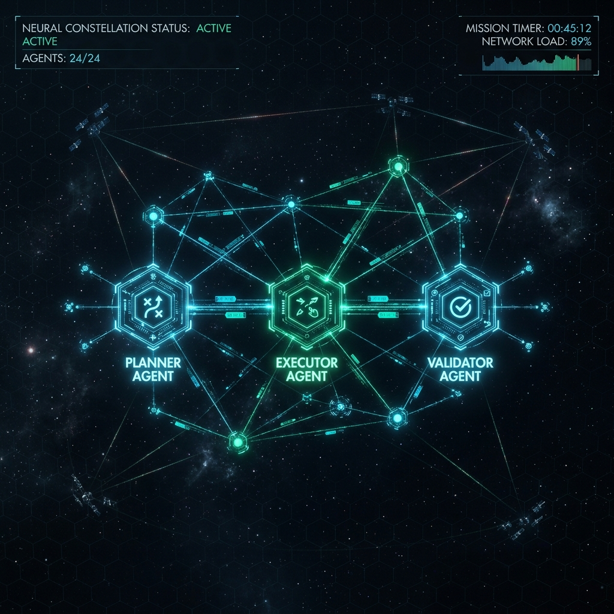
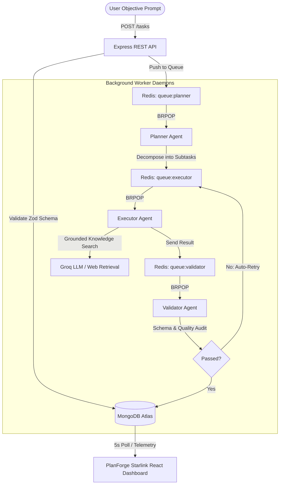

# ⚡ PlanForge — Autonomous Multi-Agent Orchestration Platform



> **PlanForge** is an enterprise-grade autonomous multi-agent orchestration state machine engineered to decompose complex high-level objectives into verified, self-healing execution workflows in real time.

---

## 🚀 Key Features

* **SpaceX Starlink-Inspired UI/UX**: Ultra-sleek, deep space dark mode theme featuring glassmorphism cards, responsive navigation, stat telemetry counters, and high-contrast typography.
* **Autonomous 3-Tier Agent Pipeline**:
  * 🧭 **Planner Agent**: Instantly decomposes open-ended user objectives into ordered, atomic subtasks with dependency tracking.
  * ⚡ **Executor Agent**: Executes subtasks using high-speed LLMs grounded with real-time web research and knowledge retrieval.
  * 🛡️ **Validator Agent**: Performs self-healing quality assurance, verifying outputs against strict schemas and managing automatic retry loops.
* **Resilient Distributed Queue System**: Decoupled asynchronous processing driven by **Redis Priority Queues** (`queue:planner`, `queue:executor`, `queue:validator`) and stateful **MongoDB** persistence.
* **Fault-Tolerant Infrastructure**: Integrated readiness guards (`Mongoose` & `RedisClient`) returning clean `503 Service Unavailable` status codes with `Retry-After` headers during connection blips to prevent server crashes.
* **Rich ChatGPT-Style Markdown Rendering**: Seamlessly presents code blocks, inline code chips, structured tables, and formatted research reports.

---

## 🏗️ Architecture Workflow



---

## 🛠️ Technology Stack

| Layer | Technology |
|---|---|
| **Frontend** | React 18, Vite, Vanilla CSS (Starlink Theme System), React Markdown, Remark GFM |
| **Backend API** | Node.js, Express.js, Zod Input Validation, Mongoose ODM |
| **Messaging & Storage** | Redis Cloud (Priority Queues), MongoDB Atlas (State Machine) |
| **AI & Orchestration** | Groq API (`llama-3.3-70b-versatile`), LangChain, Web Grounding Services |

---

## 📂 Repository Structure

```
PlanForge/
├── src/
│   ├── backend/
│   │   ├── agents/          # Autonomous Agent Daemons (Planner, Executor, Validator)
│   │   ├── config/          # Database (db.js) and Redis (redis.js) Clients
│   │   ├── middleware/      # Rate Limiting & Error Handlers
│   │   ├── models/          # Mongoose Task Schema & State Definitions
│   │   ├── routes/          # REST API Endpoints (/tasks)
│   │   ├── services/        # Task Coordinator & Registry Services
│   │   ├── index.js         # Express API Server Entry Point
│   │   └── worker.js        # Background Agent Worker Daemon Entry Point
│   └── frontend/
│       ├── public/          # Static Assets & Screenshots
│       ├── src/
│       │   ├── components/  # LandingPage, Dashboard, TaskSubmit, TaskDetail, MarkdownRenderer
│       │   ├── App.jsx      # Main Application Container
│       │   └── index.css    # Starlink Design System & Global Styles
│       ├── index.html       # Vite HTML Entry
│       └── vite.config.js   # Vite Server Configuration
├── .env.example             # Environment Variable Template
├── docker-compose.yml       # Containerized Orchestration Config
└── README.md                # Documentation
```

---

## ⚡ Quick Start & Local Setup

### 1. Prerequisites
Ensure you have the following installed:
* **Node.js**: `v18.x` or higher
* **npm**: `v9.x` or higher
* **MongoDB**: A running MongoDB Atlas cluster URI or local MongoDB instance
* **Redis**: A running Redis Cloud instance or local Redis server (`redis://localhost:6379`)
* **Groq API Key**: Obtainable from [Groq Console](https://console.groq.com/)

### 2. Environment Configuration
Create a `.env` file in the root directory (or update `src/backend/.env`):

```env
PORT=5000
MONGODB_URI=mongodb+srv://<username>:<password>@cluster.mongodb.net/planforge?retryWrites=true&w=majority
REDIS_URL=redis://:<password>@<host>:<port>
GROQ_API_KEY=gsk_your_groq_api_key_here
```

### 3. Installation
Install dependencies for both backend and frontend:

```bash
# Install root/backend dependencies
npm install

# Install frontend dependencies
cd src/frontend && npm install && cd ../..
```

### 4. Running the Application

In separate terminal windows, start the three core components:

```bash
# Terminal 1: Start Backend API Server (Port 5000)
cd src/backend
node index.js

# Terminal 2: Start Background Agent Worker Daemons
cd src/backend
node worker.js

# Terminal 3: Start Frontend App (Port 3000)
cd src/frontend
npm run dev
```

Open `http://localhost:3000` in your browser to launch **PlanForge**.

---

## 🌐 API Reference

| Endpoint | Method | Description | Request / Response |
|---|---|---|---|
| `/tasks` | `POST` | Dispatch a new objective | Body: `{ "prompt": "String (min 5 chars)" }` |
| `/tasks` | `GET` | Fetch 15 most recent tasks for telemetry | Returns Array of Task objects |
| `/tasks/:id` | `GET` | Fetch detailed state of a specific task | Returns single Task object |

---

## 📜 License

Distributed under the MIT License. See `LICENSE` for details.

Developed with ⚡ by **[Satyam Ranjan](https://github.com/SatyamRanjan-404)**.
